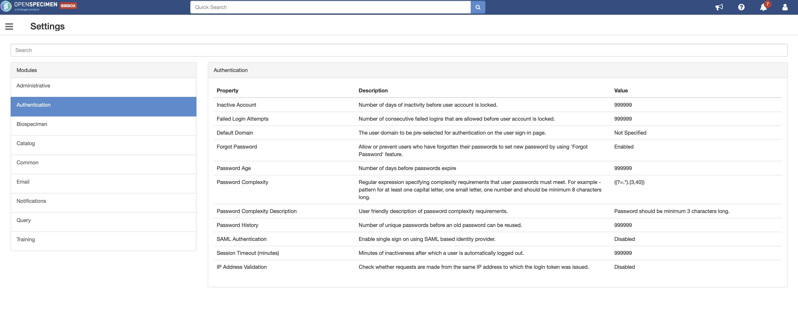

## Configure Openspecimen

- Login with tge default OpenSpecimen Account

- Add Institutes
- Add Sites
- Add Users
- Change all Password to vendetta, you can also do it in a quick way in the DB
http://adminer.silicolab.bibbox.org/?server=sample-management-openspecimen-db&username=openspecimen&db=openspecimen&select=catissue_user the password Hash for vendetta is "$2a$10$CyTLbTODgoLRGx1tr3VlVuZHtvXMPk.Ggdq1EdJOrAzGh/lSNqL5." 

